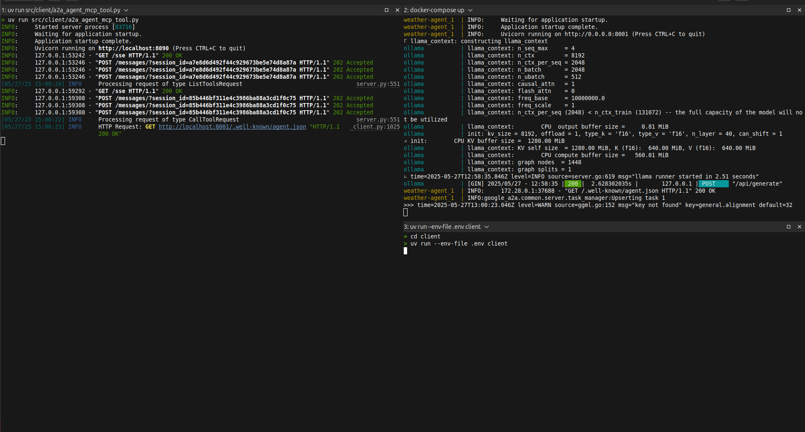

# Playing with A2A
The initial idea with this here repository was to create a setup where I can play arround with A2A and MCP.  

There is a docker-compose file that will start the weather-agent and a ollama container.  
They are both connected - and the plan is to create a MCP server that can handle the actual weather part of the weather-agent. 

Feel free to play arround and create PR's fi you would like to add more functionallity :punch:  

Beaware that you need UV and docker/docker-compose to get this here code working. So Install it if you do not already have it installed.  

UV: https://docs.astral.sh/uv/getting-started/installation/
Docker: https://docs.docker.com/get-started/introduction/get-docker-desktop/
  


Now you have UV, you can now start the show. :boom:

Get it working:
```
docker-compose up 
```
use `crtl+c` to kill the running docker-compose  

detached mode:
```
docker-compose up -d
```

When the agent and the ollama has started we can use the client to access the Agent and try it out.

start the cli - a2a: 
```
cd client
uv run src/client/__init__.py --agent=http://localhost:8001
======= Agent Card ========
{"name":"Weather Agent","description":"This agent provide a weather forcast for a given location","url":"http://0.0.0.0:8001/","version":"0.1.0","capabilities":{"streaming":false,"pushNotifications":false,"stateTransitionHistory":false},"defaultInputModes":["text"],"defaultOutputModes":["text"],"skills":[{"id":"weather-agent-skill","name":"Weather Tool","description":"Return weather forcast for the requested location","tags":["weater","weather-forcast"],"examples":["The weather in Copenhagen is partly cloudy with a high of 10 and a low of 5 degreese."],"inputModes":["text"],"outputModes":["text"]}]}
=========  starting a new task ======== 

What do you want to send to the agent? (:q or quit to exit): hello
Select a file path to attach (or press enter to finish adding files): 

{"jsonrpc":"2.0","id":"0bbf3665918c4c7aa3ec8f08206c54a3","result":{"id":"7e95242d806b425b86522dfd3535baca","sessionId":"87e853618b724066b2103f19a8fdb92f","status":{"state":"completed","message":{"role":"agent","parts":[{"type":"text","text":"Hello! How can I assist you today?"}]},"timestamp":"2025-05-20T12:47:13.916935"},"artifacts":[{"parts":[{"type":"text","text":"Hello! How can I assist you today?"}],"index":0}],"history":[{"role":"user","parts":[{"type":"text","text":"hello"}]}]}}
=========  starting a new task ======== 

What do you want to send to the agent? (:q or quit to exit): get weather from SF USA
Select a file path to attach (or press enter to finish adding files): 

{"jsonrpc":"2.0","id":"ddeb8de4d5b9423eb9a6c05b152cf8ae","result":{"id":"bde8fe9b35874a2191f274431a2a9e69","sessionId":"87e853618b724066b2103f19a8fdb92f","status":{"state":"completed","message":{"role":"agent","parts":[{"type":"text","text":"The weather forecast for San Francisco, USA from May 20 to May 26 is as follows:\n\n- On May 20, the maximum temperature will be 20.8°C with no precipitation expected.\n- On May 21, the maximum temperature will rise to 22.2°C with still no precipitation.\n- The temperature drops slightly on May 22 to a maximum of 16.7°C with no rainfall predicted.\n- May 23 sees another drop in temperature to a maximum of 15.8°C, again with no expected precipitation.\n- Temperatures rise back up to 20.4°C on May 24 with no rain forecasted.\n- The temperature falls slightly on May 25 and 26 to 16.7°C each day with no precipitation expected."}]},"timestamp":"2025-05-20T12:48:45.139293"},"artifacts":[{"parts":[{"type":"text","text":"The weather forecast for San Francisco, USA from May 20 to May 26 is as follows:\n\n- On May 20, the maximum temperature will be 20.8°C with no precipitation expected.\n- On May 21, the maximum temperature will rise to 22.2°C with still no precipitation.\n- The temperature drops slightly on May 22 to a maximum of 16.7°C with no rainfall predicted.\n- May 23 sees another drop in temperature to a maximum of 15.8°C, again with no expected precipitation.\n- Temperatures rise back up to 20.4°C on May 24 with no rain forecasted.\n- The temperature falls slightly on May 25 and 26 to 16.7°C each day with no precipitation expected."}],"index":0}],"history":[{"role":"user","parts":[{"type":"text","text":"get weather from SF USA"}]}]}}
=========  starting a new task ======== 

What do you want to send to the agent? (:q or quit to exit):

```

Start the supervisor client: 
```
cd client
uv run --env-file .env client

Final Result:
None said:

 Get weather for Paris France and is 3=2? 

 **************************************************
supervisor said:

  

 **************************************************
transfer_to_weather_agent said:

 Successfully transferred to weather_agent 

 **************************************************
weather_agent said:

  

 **************************************************
get_weather said:

 {"jsonrpc":"2.0","id":"620ee11dcede4f4ebfffaeec1042c269","result":{"id":"1","sessionId":"b98131bcab5444118f69d646037f05cc","status":{"state":"completed","message":{"role":"agent","parts":[{"type":"text","text":"The current weather in Paris, France is: \n\nTemperature: 15°C (59°F)  \nConditions: Partly cloudy  \n\nPlease note that the weather can change rapidly, so it's always a good idea to check closer to when you need the information."}]},"timestamp":"2025-05-27T13:01:01.774028"},"artifacts":[{"parts":[{"type":"text","text":"The current weather in Paris, France is: \n\nTemperature: 15°C (59°F)  \nConditions: Partly cloudy  \n\nPlease note that the weather can change rapidly, so it's always a good idea to check closer to when you need the information."}],"index":0}],"history":[{"role":"user","parts":[{"type":"text","text":"Paris, France"}]}]}} 

 **************************************************
weather_agent said:

  

 **************************************************
get_weather said:

 {"jsonrpc":"2.0","id":"49024afc5a4840c8ab5e6fc4b3019f4b","result":{"id":"1","sessionId":"b98131bcab5444118f69d646037f05cc","status":{"state":"completed","message":{"role":"agent","parts":[{"type":"text","text":"The weather forecast for Paris, France from May 27 to June 2 is as follows:\n\n- On May 27, the maximum temperature will be 20.3°C with no precipitation.\n- On May 28, expect a high of 22.5°C and light rainfall (1.1 mm).\n- May 29 will see a high of 24.1°C with no precipitation.\n- The temperature will rise to 29.5°C on May 30, still with no rain.\n- On May 31, it will be the warmest day with a high of 29.8°C and moderate rainfall (4.5 mm).\n- June 1 will cool down to 21.8°C with no precipitation.\n- The forecast for June 2 is a high of 21.3°C and no rain."}]},"timestamp":"2025-05-27T13:02:19.714784"},"artifacts":[{"parts":[{"type":"text","text":"The weather forecast for Paris, France from May 27 to June 2 is as follows:\n\n- On May 27, the maximum temperature will be 20.3°C with no precipitation.\n- On May 28, expect a high of 22.5°C and light rainfall (1.1 mm).\n- May 29 will see a high of 24.1°C with no precipitation.\n- The temperature will rise to 29.5°C on May 30, still with no rain.\n- On May 31, it will be the warmest day with a high of 29.8°C and moderate rainfall (4.5 mm).\n- June 1 will cool down to 21.8°C with no precipitation.\n- The forecast for June 2 is a high of 21.3°C and no rain."}],"index":0}],"history":[{"role":"user","parts":[{"type":"text","text":"Paris, France"}]},{"role":"user","parts":[{"type":"text","text":"Paris, France"}]}]}} 

 **************************************************
weather_agent said:

 The weather forecast for Paris, France from May 27 to June 2 is as follows:

- On May 27, the maximum temperature will be 20.3°C with no precipitation.
- On May 28, expect a high of 22.5°C and light rainfall (1.1 mm).
- May 29 will see a high of 24.1°C with no precipitation.
- The temperature will rise to 29.5°C on May 30, still with no rain.
- On May 31, it will be the warmest day with a high of 29.8°C and moderate rainfall (4.5 mm).
- June 1 will cool down to 21.8°C with no precipitation.
- The forecast for June 2 is a high of 21.3°C and no rain. 

 **************************************************
weather_agent said:

 Transferring back to supervisor 

 **************************************************
transfer_back_to_supervisor said:

 Successfully transferred back to supervisor 

 **************************************************
supervisor said:

  

 **************************************************
transfer_to_math_agent said:

 Successfully transferred to math_agent 

 **************************************************
math_agent said:

  

 **************************************************
calculator said:

 Error evaluating expression: invalid syntax (<string>, line 1) 

 **************************************************
math_agent said:

  

 **************************************************
calculator said:

 False 

 **************************************************
math_agent said:

 False 

 **************************************************
math_agent said:

 Transferring back to supervisor 

 **************************************************
transfer_back_to_supervisor said:

 Successfully transferred back to supervisor 

 **************************************************
supervisor said:

 The current weather in Paris, France is partly cloudy with a temperature of 15°C (59°F). Regarding the equation, 3 is not equal to 2, so the statement is false. 

 **************************************************
 ```

|  |
|:-----------------------------------------------------------------------------------:|
|                            Figure 1 - Running Supervisor                            |

|  |
|:----------------------------------------------------------------------------------------------:|
|                              Figure 1 - Running Supervisor After                               |


## The weather agent
The tool that is added for the weather agent - uses a name from a city and try to get the weather information for that city. 
E.g. Copenhagen Denmark or London UK.  
Output from the agent:
```text
weather-agent_1  | INFO:weather_agent.weather_mcp_server:Weather data for SF, USA:
weather-agent_1  | INFO:weather_agent.weather_mcp_server:Latitude: 37.78929
weather-agent_1  | INFO:weather_agent.weather_mcp_server:Longitude: -122.42198
weather-agent_1  | INFO:weather_agent.weather_mcp_server:Timezone: America/Los_Angeles
weather-agent_1  | INFO:weather_agent.weather_mcp_server:
weather-agent_1  | Daily Forecast:
weather-agent_1  | INFO:weather_agent.weather_mcp_server:Date: 2025-05-20
weather-agent_1  | INFO:weather_agent.weather_mcp_server:temperature_2m_max: 20.8 °C
weather-agent_1  | INFO:weather_agent.weather_mcp_server:precipitation_sum: 0.0 mm
weather-agent_1  | INFO:weather_agent.weather_mcp_server:------------------------------------------------------------
weather-agent_1  | INFO:weather_agent.weather_mcp_server:Date: 2025-05-21
weather-agent_1  | INFO:weather_agent.weather_mcp_server:temperature_2m_max: 22.2 °C
weather-agent_1  | INFO:weather_agent.weather_mcp_server:precipitation_sum: 0.0 mm
weather-agent_1  | INFO:weather_agent.weather_mcp_server:------------------------------------------------------------
weather-agent_1  | INFO:weather_agent.weather_mcp_server:Date: 2025-05-22
weather-agent_1  | INFO:weather_agent.weather_mcp_server:temperature_2m_max: 16.7 °C
weather-agent_1  | INFO:weather_agent.weather_mcp_server:precipitation_sum: 0.0 mm
weather-agent_1  | INFO:weather_agent.weather_mcp_server:------------------------------------------------------------
weather-agent_1  | INFO:weather_agent.weather_mcp_server:Date: 2025-05-23
weather-agent_1  | INFO:weather_agent.weather_mcp_server:temperature_2m_max: 15.8 °C
weather-agent_1  | INFO:weather_agent.weather_mcp_server:precipitation_sum: 0.0 mm
weather-agent_1  | INFO:weather_agent.weather_mcp_server:------------------------------------------------------------
weather-agent_1  | INFO:weather_agent.weather_mcp_server:Date: 2025-05-24
weather-agent_1  | INFO:weather_agent.weather_mcp_server:temperature_2m_max: 20.4 °C
weather-agent_1  | INFO:weather_agent.weather_mcp_server:precipitation_sum: 0.0 mm
weather-agent_1  | INFO:weather_agent.weather_mcp_server:------------------------------------------------------------
weather-agent_1  | INFO:weather_agent.weather_mcp_server:Date: 2025-05-25
weather-agent_1  | INFO:weather_agent.weather_mcp_server:temperature_2m_max: 16.7 °C
weather-agent_1  | INFO:weather_agent.weather_mcp_server:precipitation_sum: 0.0 mm
weather-agent_1  | INFO:weather_agent.weather_mcp_server:------------------------------------------------------------
weather-agent_1  | INFO:weather_agent.weather_mcp_server:Date: 2025-05-26
weather-agent_1  | INFO:weather_agent.weather_mcp_server:temperature_2m_max: 16.7 °C
weather-agent_1  | INFO:weather_agent.weather_mcp_server:precipitation_sum: 0.0 mm
weather-agent_1  | INFO:weather_agent.weather_mcp_server:------------------------------------------------------------
```


To-do's: 
- [x] Make the last part of the weather-agent - Tool that can handle the weather part of things
- [ ] Make a MCP Server for MySQL that can be used to store the output from the weather-agent
- [ ] Write better documentation
- [ ] Make a client that can be used instead of the A2A Google CLI
