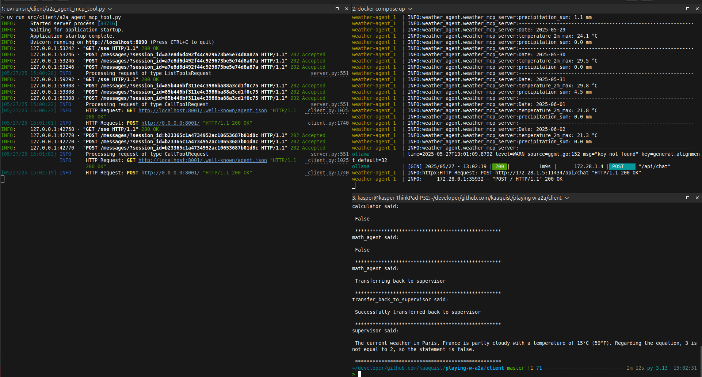

# Playing with A2A
> How do I get to use an A2A Agent in a LangGraph Supervisor setup?

|  |
|:----------------------------------------------------------------------------------:|
|                       Figure 1 - Diagram of today's approach                        |

The initial idea with this here repository was to create a setup where I can play arround with A2A and MCP.  

There is a docker-compose file that will start the weather-agent and a ollama container.  
They are both connected - and the plan is to create a MCP server that can handle the actual weather part of the weather-agent. 

Feel free to play arround and create PR's fi you would like to add more functionallity :punch:  

Beaware that you need UV and docker/docker-compose to get this here code working. So Install it if you do not already have it installed.  

UV: https://docs.astral.sh/uv/getting-started/installation/
Docker: https://docs.docker.com/get-started/introduction/get-docker-desktop/
  


Now you have UV, you can now start the show. :boom:

Get it working:
```
docker-compose up 
```
use `crtl+c` to kill the running docker-compose  

detached mode:
```
docker-compose up -d
```

When the agent and the ollama has started we can use the client to access the supervisor via. chainlit.  
Please reference the [Client Information](client/README.md) on how to start it etc.  


#### Output from Docker-Compose - A2A Server.
|  |
|:-----------------------------------------------------------------------------------:|
|                            Figure 1 - Running Supervisor                            |

|  |
|:----------------------------------------------------------------------------------------------:|
|                              Figure 1 - Running Supervisor After                               |


## The weather agent
The tool that is added for the weather agent - uses a name from a city and try to get the weather information for that city. 
E.g. Copenhagen Denmark or London UK.  
Output from the agent:
```text
weather-agent_1  | INFO:weather_agent.weather_mcp_server:Weather data for SF, USA:
weather-agent_1  | INFO:weather_agent.weather_mcp_server:Latitude: 37.78929
weather-agent_1  | INFO:weather_agent.weather_mcp_server:Longitude: -122.42198
weather-agent_1  | INFO:weather_agent.weather_mcp_server:Timezone: America/Los_Angeles
weather-agent_1  | INFO:weather_agent.weather_mcp_server:
weather-agent_1  | Daily Forecast:
weather-agent_1  | INFO:weather_agent.weather_mcp_server:Date: 2025-05-20
weather-agent_1  | INFO:weather_agent.weather_mcp_server:temperature_2m_max: 20.8 °C
weather-agent_1  | INFO:weather_agent.weather_mcp_server:precipitation_sum: 0.0 mm
weather-agent_1  | INFO:weather_agent.weather_mcp_server:------------------------------------------------------------
weather-agent_1  | INFO:weather_agent.weather_mcp_server:Date: 2025-05-21
weather-agent_1  | INFO:weather_agent.weather_mcp_server:temperature_2m_max: 22.2 °C
weather-agent_1  | INFO:weather_agent.weather_mcp_server:precipitation_sum: 0.0 mm
weather-agent_1  | INFO:weather_agent.weather_mcp_server:------------------------------------------------------------
weather-agent_1  | INFO:weather_agent.weather_mcp_server:Date: 2025-05-22
weather-agent_1  | INFO:weather_agent.weather_mcp_server:temperature_2m_max: 16.7 °C
weather-agent_1  | INFO:weather_agent.weather_mcp_server:precipitation_sum: 0.0 mm
weather-agent_1  | INFO:weather_agent.weather_mcp_server:------------------------------------------------------------
weather-agent_1  | INFO:weather_agent.weather_mcp_server:Date: 2025-05-23
weather-agent_1  | INFO:weather_agent.weather_mcp_server:temperature_2m_max: 15.8 °C
weather-agent_1  | INFO:weather_agent.weather_mcp_server:precipitation_sum: 0.0 mm
weather-agent_1  | INFO:weather_agent.weather_mcp_server:------------------------------------------------------------
weather-agent_1  | INFO:weather_agent.weather_mcp_server:Date: 2025-05-24
weather-agent_1  | INFO:weather_agent.weather_mcp_server:temperature_2m_max: 20.4 °C
weather-agent_1  | INFO:weather_agent.weather_mcp_server:precipitation_sum: 0.0 mm
weather-agent_1  | INFO:weather_agent.weather_mcp_server:------------------------------------------------------------
weather-agent_1  | INFO:weather_agent.weather_mcp_server:Date: 2025-05-25
weather-agent_1  | INFO:weather_agent.weather_mcp_server:temperature_2m_max: 16.7 °C
weather-agent_1  | INFO:weather_agent.weather_mcp_server:precipitation_sum: 0.0 mm
weather-agent_1  | INFO:weather_agent.weather_mcp_server:------------------------------------------------------------
weather-agent_1  | INFO:weather_agent.weather_mcp_server:Date: 2025-05-26
weather-agent_1  | INFO:weather_agent.weather_mcp_server:temperature_2m_max: 16.7 °C
weather-agent_1  | INFO:weather_agent.weather_mcp_server:precipitation_sum: 0.0 mm
weather-agent_1  | INFO:weather_agent.weather_mcp_server:------------------------------------------------------------
```


To-do's: 
- [x] Make the last part of the weather-agent - Tool that can handle the weather part of things
- [ ] Make a MCP Server for MySQL that can be used to store the output from the weather-agent
- [ ] Write better documentation
- [x] Make a client that can be used instead of the A2A Google CLI
