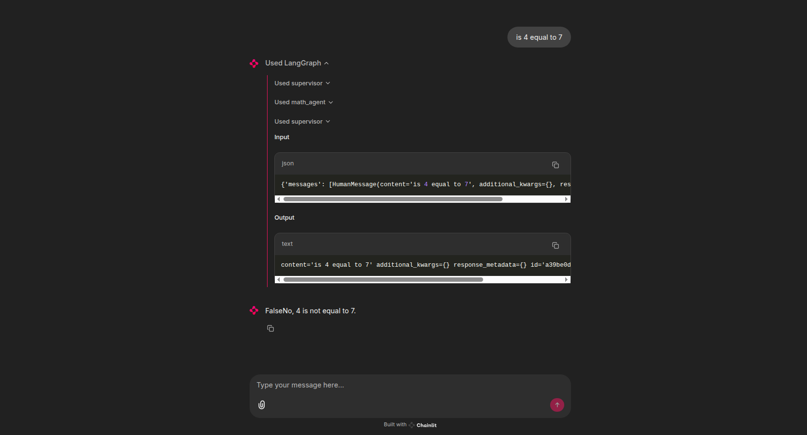
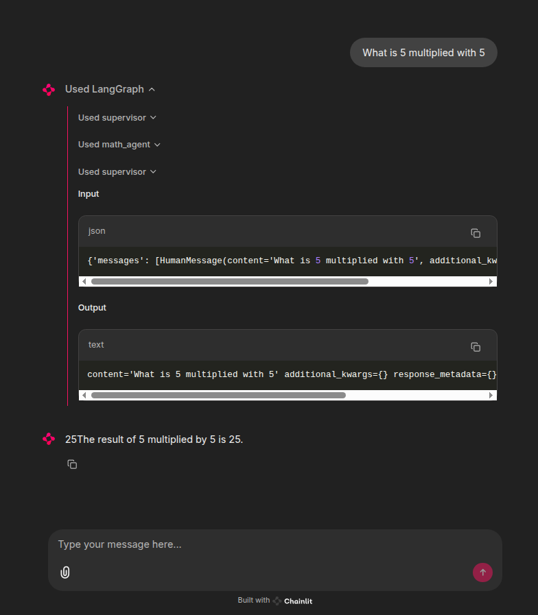
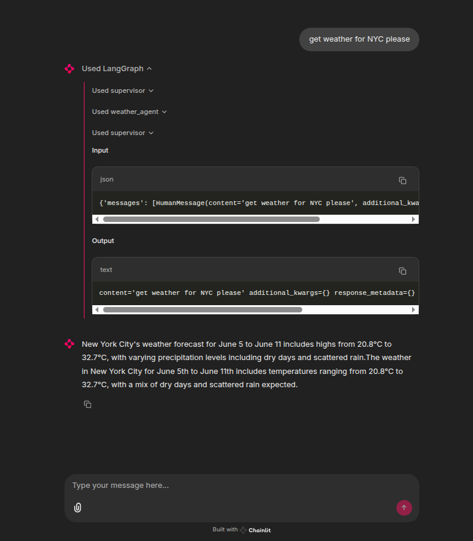

# Client - using Chainlit

### Run the client
Be aware that you need to start `docker-compose` before this here will work.  

To run the client: 
```text
uv run chainlit run src/client/client.py -w
```
In the .env file I have added a OpenAI key. 
When running the Agent Supervisor I did not manage to get a local Ollama model to work. Therefor I use the OpenAI for the Supervisor.


### create the `.env` file
```text
cat .env
OPENAI_API_KEY=sk-.... 
```

## Images of Chainlit
|  |
|:---------------------------------------------------------------------------------------:|
|                          Figure 1 - Chainlit - Math Agent Eval                          |


|  |
|:------------------------------------------------------------------------------------------------:|
|                            Figure 1 - Chainlit - Math Agent Multiply                             |


|  |
|:----------------------------------------------------------------------------------------------:|
|                            Figure 1 - Chainlit - Weather Agent NYC                             |


TODO's 
- [ ] Find a Ollama - small model the will work with the langgraph supervisor setup
- [ ] make the wrapper avoid hardcoded values.
- [ ] there is probably missing something

